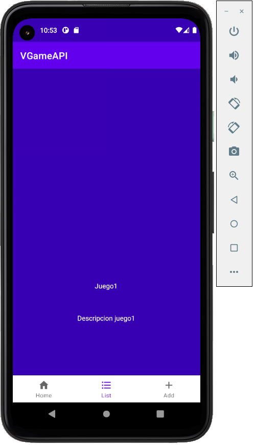

# MaiguaPaul_VGameAPI
This project is about the development of an android app named "VGameAPI", which serves as a database for storing game genres information.
## Tasks
In my project you'll be able to:
* Login
* Add elements (game genres names and descriptions) to a local database
* See all the database elements inside a list
* See the detailed information of each element in a separate fragment
* Delete all the elements from the database
## Screenshots
### Login
The login section of the app is done through the main activity.\

### Splash screen
This is the splash screen with the app logo that shows 2 seconds before the app starts.\

### Home screen
The home section is a fragment which only shows a delete button for the DB.\
There's also the bottom navigation, which allows the user to navigate through all sections of the app.\

### List screen
The list screen displays the list of items with the elements from the database.\

### Add screen
The add screen has an EditText to enter the name of a game genre and add it to the DB.\

### Options screen
The options screen allows the user to change settings: Night/Day Mode, Language, Delete Preferences.\

### Detail screen
The detail screen shows the details of the object from the recycler view such as a description.\

## Technologies
This project is developed with android studio and java. I've used this extra classes:
* SQLiteDatabase: for the local storage.
* Fragment Manager: to add/access the different fragments for each task.
* Recycler View: to show the items in the DB ordered in a list.
* Toast: to show a text message confirming that the task has been performed correctly.
* Shared Preferences: to save info inside the app so it doesn't get deleted after closing the app.
* Bundle: to share info (objects) between fragments/activities.
## Extra information
### Access:
* Username: admin
* Password: admin
### Colors used:
Purple_500 (#6200EE), purple_700 (#3700B3) and white (#FFFFFF).
### Logo:
Controller.png image from assets_studio.\

### Errors:
- The delete button from the home screen crashes the app due to the DB not created yet after the login. The DB is created after choosing another screen.
- The delete button doesn't delete the default items in the list. This is because they're not inserted into the database.
## Finished / Unfinished tasks
- [x] Splash Screen
- [x] Bottom Navigation
- [x] Local Storage SQLite
- [x] Login
- [x] Add form
- [x] Recycler list
- [x] Database methods
- [x] Delete all data + dialog
- [x] Screens colors with Theme.xml
- [x] Multilanguage 
- [x] Shared Preferences & Bundle
- [x] Detail Fragment
